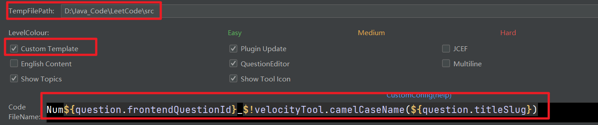
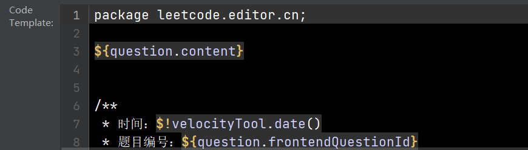

## 第一部分标题：
Num${question.frontendQuestionId}_$!velocityTool.camelCaseName(${question.titleSlug})

## 第二部分模板：

package leetcode.editor.cn;

${question.content}

/**
* 时间：$!velocityTool.date()
* 题目编号：${question.frontendQuestionId}
* 题目标题：${question.title}
  */
  public class Num${question.frontendQuestionId}_$!velocityTool.camelCaseName(${question.titleSlug}){

  public static void main(String[] args) {
  Solution solution = new Num$!{question.frontendQuestionId}_$!velocityTool.camelCaseName(${question.titleSlug})().new Solution();
  // TO TEST
  }

  ${question.code}
  }

